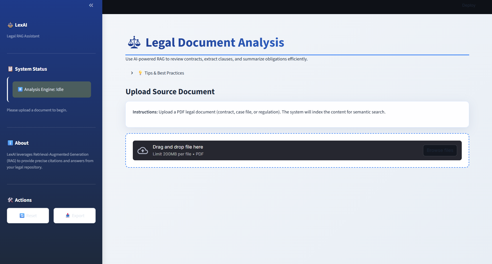
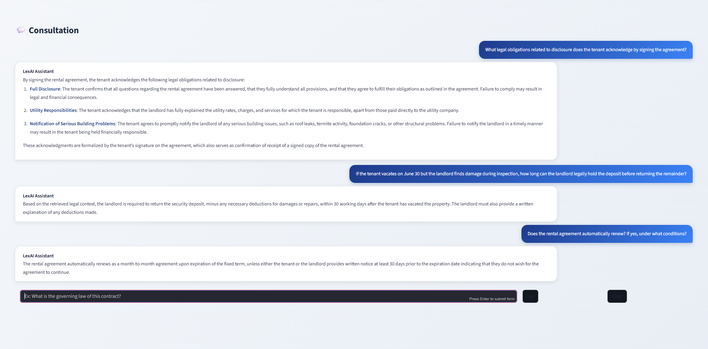

# LexAI — Legal RAG Assistant

A Retrieval-Augmented Generation (RAG) assistant for legal document analysis and question answering, built with Streamlit. LexAI lets you upload a PDF legal document, builds a semantic index (FAISS) using Azure OpenAI embeddings, and answers legal queries with supporting context from your documents.

Screenshots
- Upload UI: assets/screenshot1.png  
  

- Consultation / Chat results: assets/screenshot2.png  
  

Features
- Upload a PDF and build a semantic FAISS index for quick retrieval.
- Use quick actions (summarize, extract clauses, list risks, dates).
- Ask free-form legal questions and get answers sourced from the indexed document.
- Export chat sessions as JSON for record-keeping.
- Robust UI with custom styles and a friendly assistant persona.

Security & privacy notes
- Never commit your real API keys or other secrets to the repository. Use the provided `.env.example` as a template and create a `.env` locally (which should be in `.gitignore`).
- The index (FAISS store) will be written locally to `rag_faiss_store/` by default — treat this as sensitive if it contains private documents.

Quick start (local)
1. Clone the repo and cd into it:
   ```bash
   git clone https://github.com/<your-username>/<repo-name>.git
   cd <repo-name>
   ```

2. Create and activate a Python virtual environment:
   - macOS / Linux:
     ```bash
     python3 -m venv venv
     source venv/bin/activate
     ```
   - Windows:
     ```powershell
     python -m venv venv
     venv\Scripts\activate
     ```

3. Install dependencies:
   ```bash
   pip install -r requirements.txt
   ```

4. Create an `.env` file from the example and fill in your Azure OpenAI values:
   ```bash
   cp .env.example .env
   # then open .env and add real values
   ```

   Required environment variables (example names in `.env.example`):
   - AZURE_OPENAI_API_KEY
   - AZURE_OPENAI_ENDPOINT
   - AZURE_OPENAI_API_VERSION
   - AZURE_OPENAI_EMBEDDING_DEPLOYMENT
   - AZURE_OPENAI_CHAT_DEPLOYMENT

   Important: Use your Azure OpenAI deployment names (the "deployment" you created in Azure) rather than raw model names when using the Azure-compatible SDKs.

5. Run the app:
   ```bash
   streamlit run app.py
   ```
   - Upload a PDF via the UI, wait for indexing to complete, then ask queries.

How indexing works (high-level)
- app.py saves the uploaded PDF temporarily, uses PyMuPDF (fitz) to extract metadata, and calls build_index_from_pdf in rag_index_builder.py.
- rag_index_builder.py uses a text splitter to chunk the document, creates embeddings using the AzureOpenAIEmbeddings wrapper, and stores the vectors in a FAISS store saved to `rag_faiss_store/`.
- The assistant calls tools.retrieve_legal_context to perform similarity search and returns the top k documents as context to the assistant.

Repository structure (recommended)
- app.py
- rag_index_builder.py
- tools.py
- main_chat.py
- requirements.txt
- .env.example
- .gitignore
- assets/
  - screenshot1.png
  - screenshot2.png
- rag_faiss_store/  (generated after indexing)

Commands to create a public GitHub repo and push (two options)

Option A: Using GitHub CLI (recommended)
1. Login (if necessary):
   ```bash
   gh auth login
   ```
2. Create repo and push:
   ```bash
   # from repo root
   git init
   git add .
   git commit -m "Initial commit — LexAI legal RAG assistant"
   gh repo create <your-username>/<repo-name> --public --source=. --remote=origin --push
   ```

Option B: Using standard git + GitHub website
1. Create an empty public repo on github.com via the website.
2. Then run:
   ```bash
   git init
   git add .
   git commit -m "Initial commit — LexAI legal RAG assistant"
   git remote add origin https://github.com/<your-username>/<repo-name>.git
   git branch -M main
   git push -u origin main
   ```

Notes & small suggestions to improve code (optional)
- .env file in your snapshot contains quotes and spaces around variables. Use a simple key=value format in `.env` (example included in `.env.example`) so dotenv loads properly.
- Consider protecting the FAISS store or adding an option to upload it to a secure store if you plan to share or deploy the app.
- Consider adding unit tests and automated checks (pre-commit) for stability.

If you want, I can:
- Produce a ready-to-run ZIP with all files arranged and the two images named exactly as the README expects (you'd then upload that package).
- Or, if you authorize me to create the GitHub repo and you provide the repo owner name (your GitHub username) and confirm you want me to push, I can guide you through a GitHub auth flow (I cannot push on your behalf from here).
